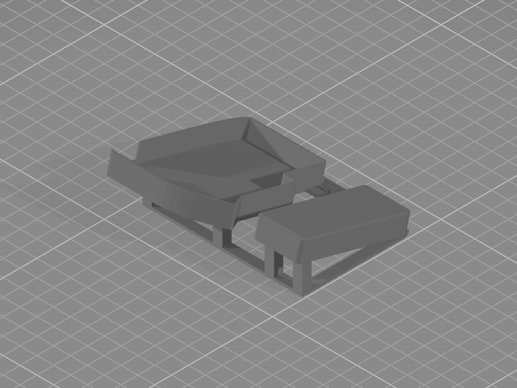
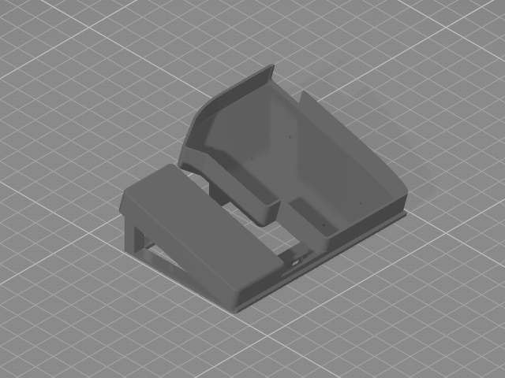
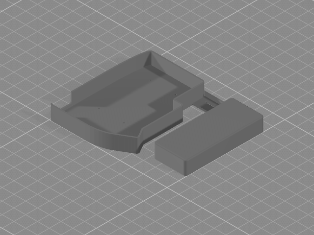
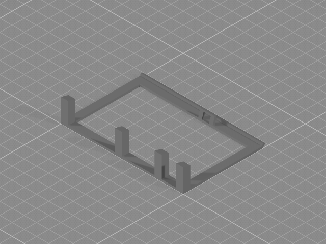

# Lily58 Case

## Built With

- [FreeCad](https://www.freecad.org/)

## Key Features

- Built-in palm rest - the palm rest should follow whatever tent or tilt you use, providing constant support as your
  keyboard shifts around.
- Modular - the base and the stand are separated, and easily assembled to allow easier adjustments to tenting angle.
- Low volume - designed to use less material and save cost. Not everyone owns a 3D printer.

## Getting Started

- Open `lily58.FCStd` with FreeCad.
- Edit the models to get the recommended measurements:
    - Set the wall height at `base > belt002 > belt001`. Set `Length Fwd` with this formula: `3mm + standoff height +
      top plate height + 0.25mm`. This should allow the wall to reach the bottom of the keycaps.
    - Set the palm rest height at `base > palm > palm001`. Set `Length Fwd` to something near the wall height. Ideally
      it should be slightly lower than your keycaps. Subtract some height if you are adding some foam.
    - *(Optional)* Adjust the length of the palm rest at `base > palrm > palm001 > Rectangle002` by setting the `y`
      position. I am 183cm. You might want to add or reduce a few mm. Ideally the bottom of the palm rest will touch
      the ball of your palm without touching your wrist.
- Export the parts: `stand`, `base`, and `lock`.

## Screenshots

